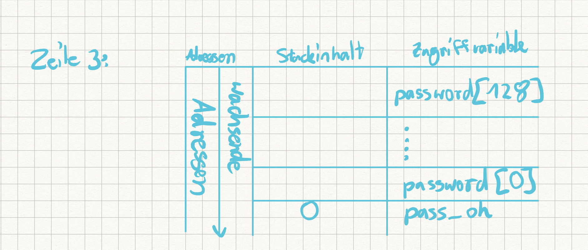

# Blatt 5

## Aufgabe 1

(1) Bei dem TOC-to-TOU-Problem handelt es sich um ein Multithreadingproblem.  
Process 1 check ob eine Condition wahr ist (TOC), ist sie wahr bzw. erfüllt oder gegeben,  
versucht er mit dieser Condition zu arbeiten (TOU). Unterbricht ein anderer Process nun genau  
nach dem Check der als wahr gewertet wurde und vor dem Benutzen, kann er den von Prozess 1 benötigeten  
Ressourcen verwenden oder aufbrauchen, wodurch wenn Prozess 1 wieder weiter macht, ausgehend von dem  
Korrekten Check, kann der Prozess abstürzen.  

(2)wenn das Bit gesetzt ist  bei einem Program, werden zusätzlich zu den Rechten des Benutzers, der die Datei ausführt, auch die Rechten des Benutzers mit ausgeführt, dem die Datei gehört ("owner"). Der Zweck ist es unprivilegierten Benutzern  und Prozessen einen kontrollierten Zugriff auf privilegierte Ressourcen zu ermöglichen

(3) chmod

Chmod u+s "Datei" 

 

(5)Ein symlink (symbokic Link) beschreibt eine Verknüpfung in einem Dateisystem, die eine Referenz zu einer anderen Datei oder Verzeichnis aufweist. Bei löschen oder verschieben dieser ist im Normalfall die Referenz dann "ins leere". Die Referenz ist nicht gleichwertig zum eigentlichen Dateisystem-Eintrag . 

Man kann sie mit 

ln -s /Zieldatei /Referenz
Erstellen

## Aufgabe 2
	
	(1) Signatur von printf: int printf(const char *format,...)  
	"..." heißt man kann endlich viele Variablen übergeben welche im format string entsprechend  
	des Datentyps "aufgerufen" werden müssen.

	(2) al: Anzahl floating point Parameter  in Vektor Register  
		__m256 & __m512 Variablenargumente auf den Stack  

	(3) Ein Formatstring enthält informatien wie viele Parameter der  
	Funktion auf dem Stack übergeben wurden und deren Datentypen

	(4) 

	(5) ./main "%x %x %x"

	(6) als erstes wird 1 in den stack geschrieben, dann die adresse von i, dann wird prinf ausgeführt 

## Aufgabe 4

	(1) 
 
